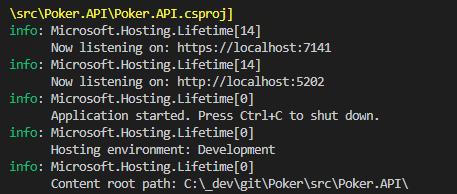
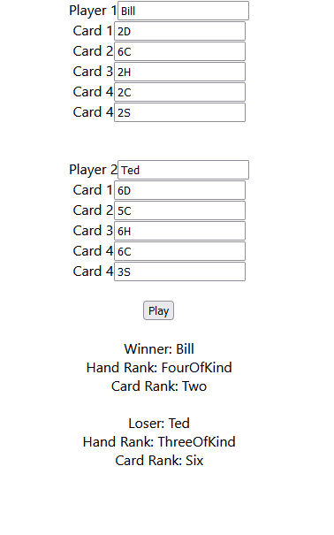

# Poker React Web Api

This demo contains a .Net Core 6 Web Api server to determine the outcome of 2 Poker hands.

React was used as a front end, allowing the user to input values for two poker hands. Once entered the hands can be submited through the Web Api to determine which hand wins.

# Prerequisites
The app and web Api were built and ran using Visual Studio Code as the IDE.

The following list of tools need to be installed below:

[Visual Studio Code](https://code.visualstudio.com/download)

[C# for VS Code](https://marketplace.visualstudio.com/items?itemName=ms-dotnettools.csharp)

[.Net Core 6](https://dotnet.microsoft.com/en-us/download/dotnet/6.0)

[Node JS](https://nodejs.org/en/download/)


## Web Api Setup

The following steps detail how to run the Web API service.

1) Run a .NET restore on the project from the terminal:
```
cd /src/Poker.API

dotnet restore
```

2) Trust HTTPS development certificate using the .NET CLI command:

```
dotnet dev-certs https --trust
```

3) Build and run the .NET Core Web API service from the terminal:
```
cd /src/Poker.API

dotnet run
```

4) The terminal will display the localhost and port. Open a browser and navigate to the service page. 



5) Swagger provides an interface to interact with the available Rest calls. Currenlty there is a POST **api/Poker**.
```
https://localhost:7141/swagger/
```

## Web App
For the front end, a simple web app using React has been created. The following steps detail how to setup and run the application.

1) Open a new terminal and navigate to the web app project:
```
cd src/poker.ui
```

2) Install third-party npm packages:
```
npm install
```

3) Update the Api **POST** ```pokerUrl``` in ```src/poker.ui/App.js``` with the correct service endpoint.
```
 const pokerUrl = 'https://localhost:7141/api/Poker';
```

3) Run the app from the terminal:
```
npm start
```

4) Update inputs for each player including, name and card values. To evaluate the winner press **Play**. The results will be listed below for each hand.


